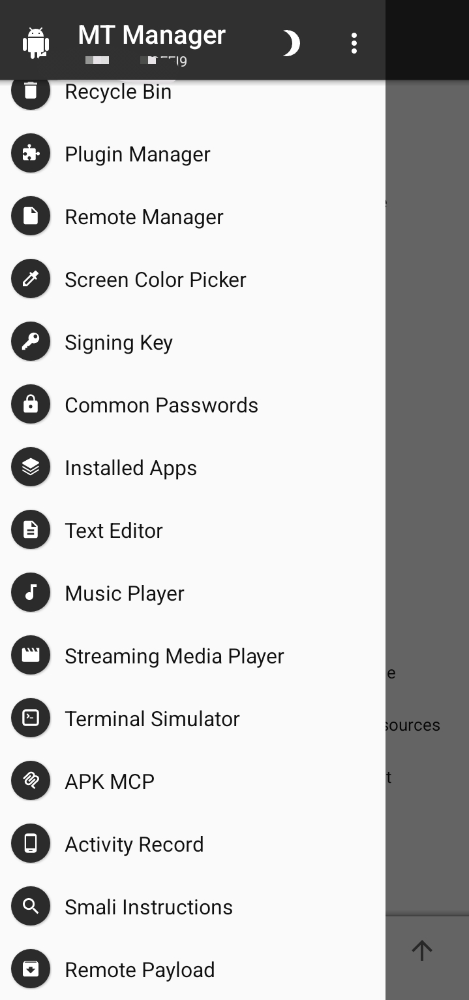
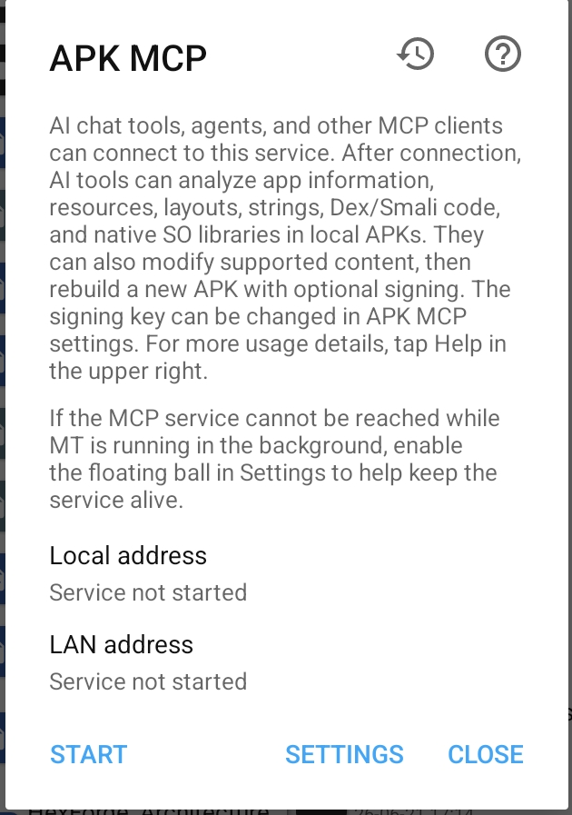
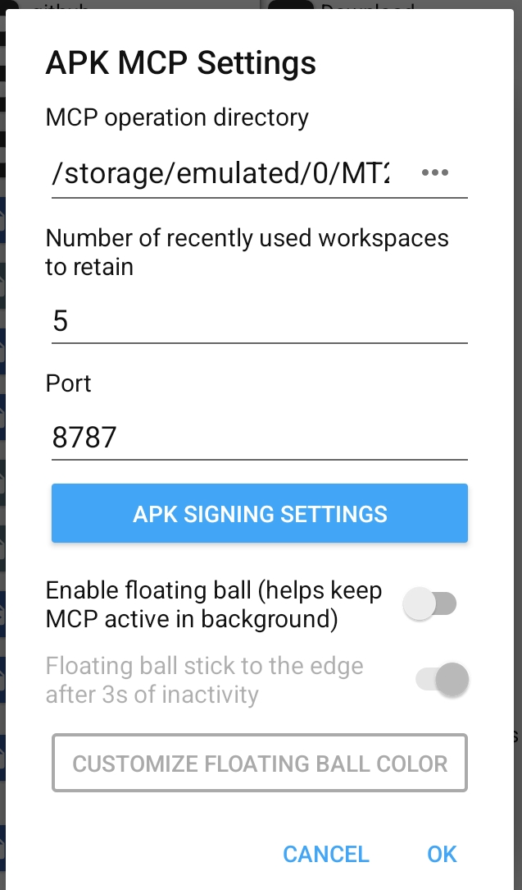
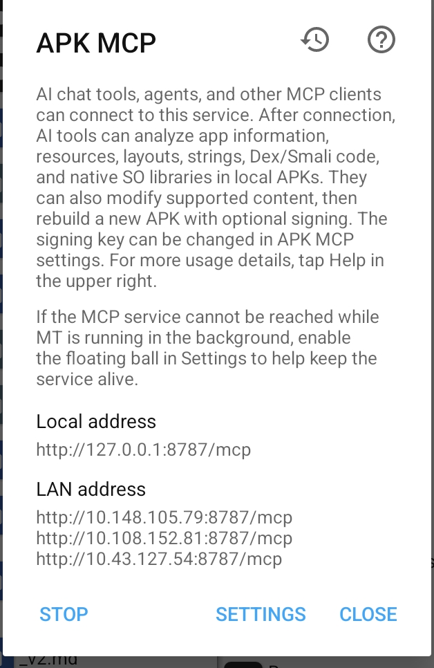

# MT Manager APK MCP Setup

Setup steps for the `apkmcp` agent - HexForge's client for MT Manager's
built-in "APK MCP" service (Android only). Confirmed against MT
Manager's actual UI rather than guessed at; if your version's wording
differs, [MT Manager's official site/docs](https://mt2.cn/) are the
source of truth over this file.

## 1. Find it

In MT Manager, open the tools/menu drawer. **APK MCP** sits between
**Terminal Simulator** and **Activity Record** (a paperclip-style icon):



Tapping it opens the APK MCP dialog. Before starting the service, it
looks like this - both addresses show "Service not started":



- **Local address**: `Service not started`
- **LAN address**: `Service not started`
- Buttons: **START**, **SETTINGS**, **CLOSE**

## 2. Configure it (tap SETTINGS first)

Worth setting these before your first **START**, since the operation
directory can't be changed while APK MCP is running:



- **MCP operation directory** — the folder MT Manager treats as the
  root for every `path` argument the `apkmcp` agent sends. Everything
  `open`/`list_available_apks` reference is **relative to this
  directory** (see the note in the main README) - absolute paths are
  rejected. Point this at wherever your APKs actually live, e.g.
  `/storage/emulated/0/MT2/apks` or similar. Tap the `...` button to browse.
- **Number of recently used workspaces to retain** — default `5`. How
  many MT-side "workspaces" (opened APKs) MT Manager keeps warm at once;
  doesn't map to anything in HexForge's own workspace concept - these are
  two separate, same-named ideas in two different apps.
- **Port** — default `8787`. Matches the `apkmcp` agent's own default
  `baseUrl` (`http://127.0.0.1:8787/mcp`) - leave this alone unless you
  have a real conflict, since changing it means also setting `baseUrl`
  in every `apkmcp` task's payload from then on.
- **APK SIGNING SETTINGS** — a separate screen for the signing key MT
  uses when `mt_apk_build` (rebuild) re-signs an APK. Corresponds to MT
  Manager's own **Signing Key** tool elsewhere in the app - same key,
  reused here.
- **Enable floating ball (helps keep MCP active in background)** — off
  by default. **Turn this on if you'll use `apkmcp` for anything beyond
  a quick one-off call.** Android's battery management can pause MT
  Manager once it's backgrounded, which silently kills the MCP service
  along with it - the Gateway then gets a connection-refused error that
  looks like a HexForge problem but isn't. The floating ball is MT's own
  workaround: a persistent on-screen element that keeps the app (and
  therefore APK MCP) alive while backgrounded. This is the single most
  common reason `apkmcp` calls fail intermittently on a real device -
  check this setting before debugging anything else.
  - **Floating ball stick to the edge after 3s of inactivity** - a
    sub-option, grayed out until the floating ball itself is enabled.

Tap **OK** to save.

## 3. Start it

Back on the main APK MCP dialog, tap **START**. Once running, both
addresses populate for real:



- **Local address**: `http://127.0.0.1:8787/mcp` - this is what the
  Gateway actually uses (same device, loopback), matching `apkmcp.agent.ts`'s
  default `baseUrl`.
- **LAN address**: one line per network interface, e.g.
  `http://10.148.105.79:8787/mcp` - only relevant if the Gateway is
  running on a *different* device than MT Manager (not the typical
  Termux-on-the-same-phone setup this project defaults to).
- Buttons become **STOP**, **SETTINGS**, **CLOSE**.

## 4. Verify from HexForge

```bash
curl -X POST http://localhost:8080/workspaces/<id>/tasks \
  -H "Content-Type: application/json" \
  -d '{"agent": "apkmcp", "operation": "list_available_apks", "payload": {}}'
```

If this fails with a connection error and you *just* confirmed APK MCP
shows as running on the phone, the floating ball setting above is the
first thing to check - not the Gateway config.
